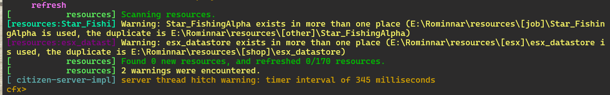
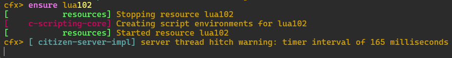
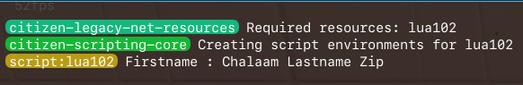

# Lua102 Variable Global and Variable Local

```
This Lua programing project create for my portfolio
```

## Variable Global and Local

### Client file in client folder

```lua
local name = "Chalaam" -- การประกาศตัวแปรแบบ global

Citizen.CreateThread(function()
    local lastname = "Zip" -- การประกาศตัวแปร local
    Citizen.Wait(0) -- หน่วงเวลา
    print('Firstname : '..name.." Lastname "..lastname) --  แสดงค่า
end)
```

#### Run file server.bat
#### เข้าสู่เกมส์

#### ดำเนินการใช้คำสั่ง  refresh



#### ดำเนินการใช้คำสั่ง  ensure nameFile(ชื่อไฟล์)



#### กด f8 เพื่อตรวจสอบผลลัพธ์


